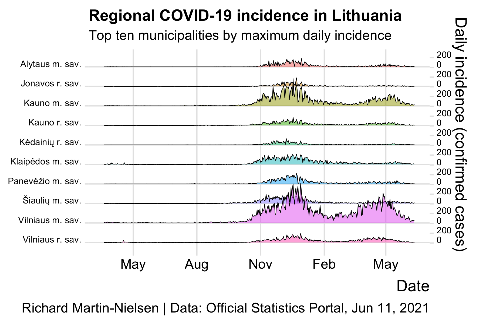
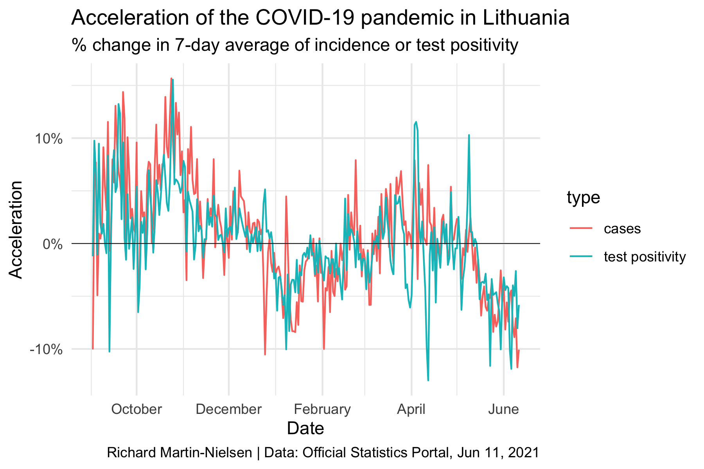
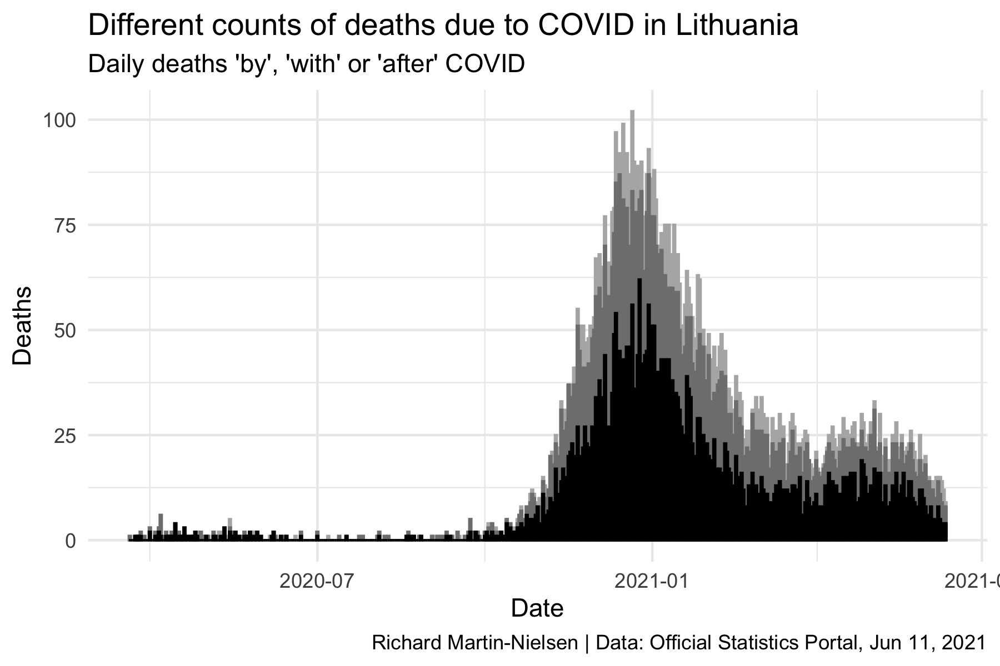

# COVID-19 Data Charts for Lithuania

This repo contains R code to generate a set of static charts representing
data on the COVID-19 pandemic in Lithuania. These charts show only past data.

In addition to the R code, github actions have been developed to update the
charts daily, though this is not yet functional (and may not be used because
of the limitations of running actions on a a free account).

This code uses the
[`covidregionaldata`](http://epiforecasts.io/covidregionaldata) package
to download data for various countries at a subregional level. The workflow
is currently set to install the github version of the package.

This package also includes a
[generic version of the graph generation code](extra/Generic_static_graphs.R).
This should generate graphs where possible for any country where 
`covidregionaldata` makes the regional data available.

Finally, for those using who like rmarkdown templated reports, there is a
[parameter-ised Rmarkdown report](extra/Country-graphs.Rmd) which lets
you select the country and enter your name. (Use `knit with parameters`.)

## Overall comparisons of municipalities

Two charts imitating those prepared by the OSP in [their analyses](https://osp.stat.gov.lt/documents/10180/8420714/1_COVID-19_situacijos_apzvalga_210215.pdf). 

## Incidence charts

Ridgeline charts showing the incidence in regions of the country. These
emphasise that the first wave was barely a ripple compared with the 
second wave, and that the incidence in the larger cities (particularly
Vilnius) has been quite separate from other municipalities.

The Lithuanian word for "municipality" is *savivaldybė*. "m. sav." is short
for "city municipality" and "r. sav." means "regional municipality"; Vilnius 
and Kaunas both have suburban municipalities which are distinguished in these
charts only by the "m." and "r."

## Acceleration of case incidence and test positivity nationwide

Acceleration is another measure used by OSP. It is intended to give a
more responsive indicator of the development of the pandemic, particularly
in comparison with 7- and 14-day averages. The time-averaged values
are used to smooth out regular weekly variation in the data but are
necessarily lagging indicators, both when incidence is rising and when
it is declining.

## Attributions of deaths

The OSP provides counts for three different criteria attributing deaths to
COVID, which roughly correspond to "of", "with" and "after". This chart
provides a comparison of how the three number of deaths attributed to COVID
according to each criterion compare.

