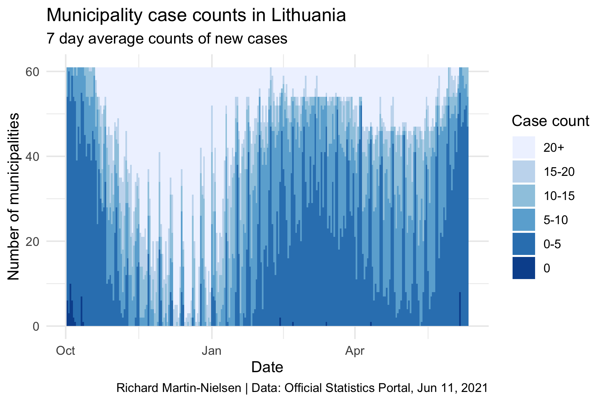
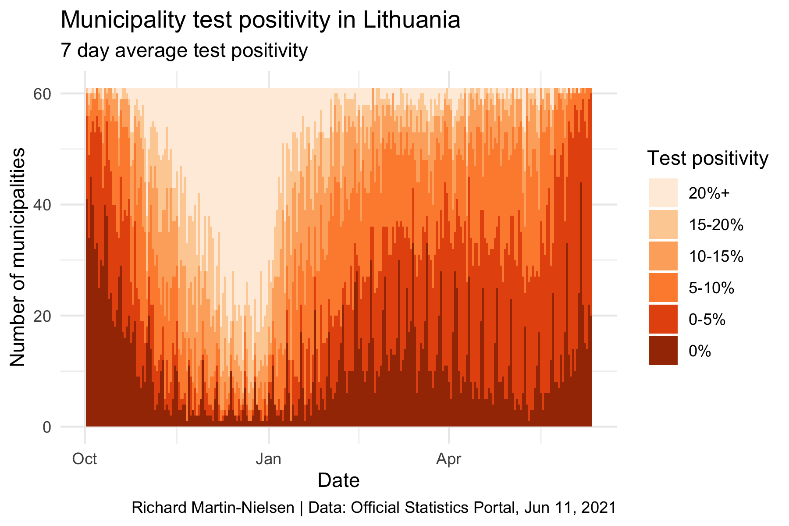
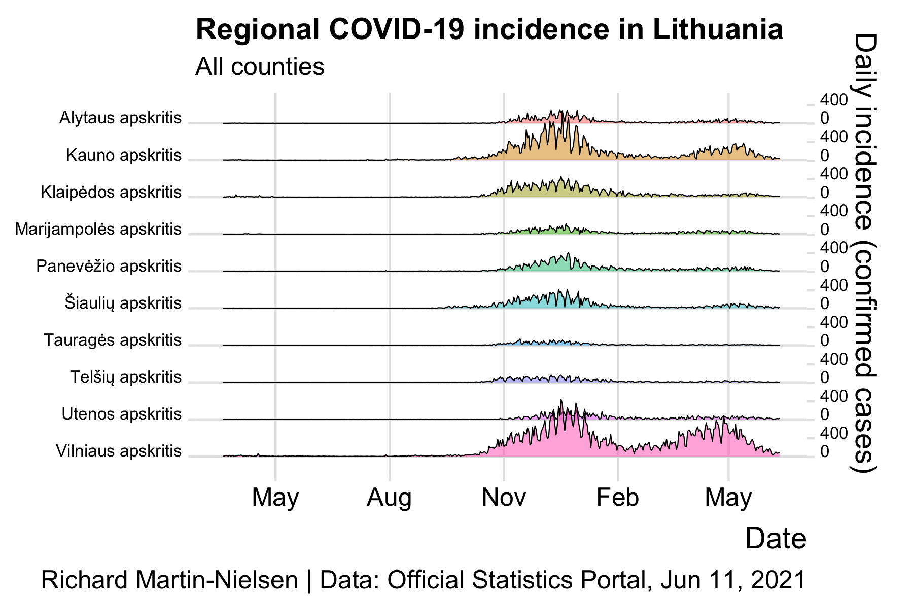

# COVID-19 Data Charts for Lithuania

This repo contains R code to generate a set of static charts representing
data on the COVID-19 pandemic in Lithuania. These charts show only past data.

In addition to the R code, github actions have been developed to update the
charts daily, though this is not yet functional (and may not be used because
of the limitations of running actions on a a free account).

Two charts imitating those prepared by the OSP in [their analyses](https://osp.stat.gov.lt/documents/10180/8420714/1_COVID-19_situacijos_apzvalga_210215.pdf). 

Ridgeline charts showing the incidence in regions of the country. These
emphasise that the first wave was barely a ripple compared with the 
second wave, and that the incidence in the larger cities (particularly
Vilnius) has been quite separate from other municipalities.

The Lithuanian word for "municipality" is *savivaldybė*. "m. sav." is short
for "city municipality" and "r. sav." means "regional municipality"; Vilnius 
and Kaunas both have suburban municipalities which are distinguished in these
charts only by the "m." and "r."
